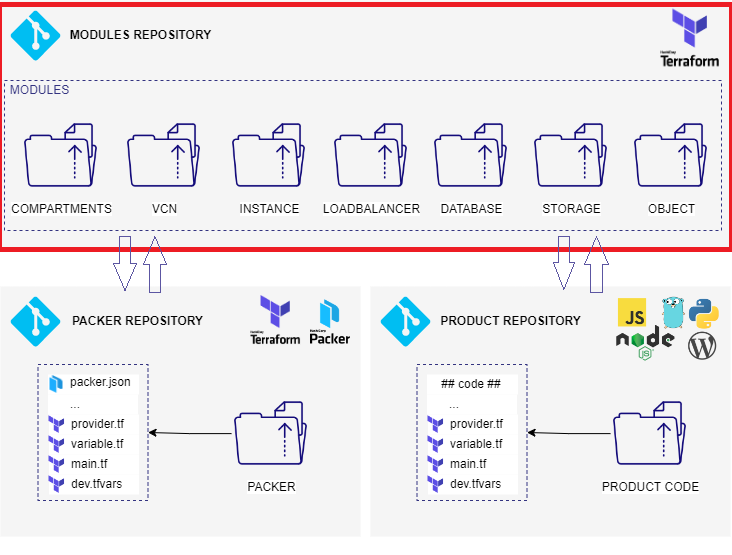

# :construction_worker: (IN CONSTRUCTION) oci-cluster-free-tier

# OCI cluster free tier

This repositóry is part of three repository, that join to build a cluster in OCI environment, with VMs that is models available in Free Tier.

## Modules Terraform

#### Modules docs

+ [modules](./modules)
    + [compartments](./modules/compartments/README.md)
    + [vcn](./modules/vcn/README.md)
    + [instance](./modules/instances/README.md)
    + [loadbalancer](./modules/loadbalancer/README.md)
    + [database](./modules/database/README.md)
    + [storage](./modules/storage/README.md)
    + [object](./modules/object/README.md)

#### Diagram

